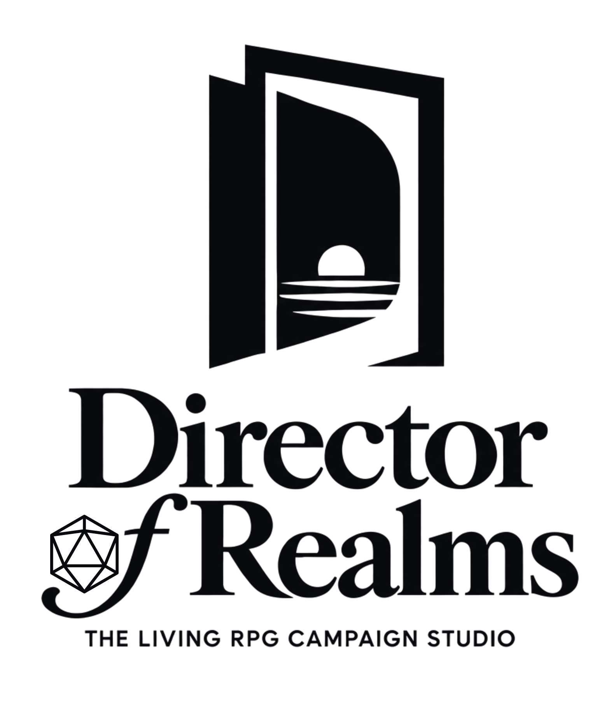

  <picture>
    <source media="(prefers-color-scheme: dark)" srcset="assets/brand/dor-full-satin-on-black-1584.png">
    <source media="(prefers-color-scheme: light)" srcset="assets/brand/dor-full-black-on-white-1584.png">
    
  </picture>

<h1 align="center">Director of Realms</h1>

<strong>Build maps. Manage campaigns. Run adventures. Keep worlds alive.</strong>

  
  
  
  

**Director of Realms 1.0** is designed as the living RPG campaign studio for Foundry VTT v14: an autonomous GM and co-GM, mapmaker, campaign manager, and persistent-world engine in one module. It will turn player choices into responsive story, playable locations, evolving characters, and consequences that carry into the next session.

The 1.0 experience is being built for fantasy, science-fiction, and horror campaigns, serving solo players, groups without a dedicated GM, and working GMs who want capable assistance while retaining the final call.

> [!IMPORTANT]
> **Director of Realms is currently pre-beta.** This page presents the intended 1.0 product and feature set. Development and release validation are still underway, and there is no public test build or supported download today. Features, tier limits, and launch details may change before release.

## The complete 1.0 campaign loop

The 1.0 studio is intended to cover four connected parts of play.

### Build maps

Generate dungeons, caves, settlements, structures, and outdoor encounters with connected routes, walls, doors, lighting, points of interest, and fog of war. Deterministic geometry will own the playable layout; optional AI art can style the scene without deciding whether the party can reach the objective.

Director of Realms will search compatible compendiums and world assets before generating new tokens, portraits, scenes, or props, helping existing collections go further.

### Manage campaigns

Prepare original settings or work with pre-written adventures. Organise campaign material, player-facing journals, GM knowledge, locations, characters, factions, quests, and session records in Foundry. Campaign tools will preserve the context needed to move from preparation to play and back again.

### Run adventures

Interpret player actions, advance objectives, call for checks, portray NPCs, create encounters, and keep the pace moving when the group leaves the prepared path. Director of Realms 1.0 is intended to run solo and small-group games or assist a human GM during preparation and live sessions.

### Keep worlds alive

Carry forward player decisions, relationships, faction standing, rumours, conflicts, objectives, and consequences. Persistent memory and world simulation will give later scenes something concrete to build on, even when the selected AI model changes.

## One studio, several specialists

The 1.0 design coordinates focused systems so each part of the campaign has a clear owner:

| System | What it contributes |
| --- | --- |
| **Director** | Narrative, pacing, challenges, encounters, and NPC decisions |
| **Architect** | Deterministic, seeded layouts and playable map geometry |
| **Painter** | Optional tokens, portraits, scenes, and visual dressing |
| **Surveyor** | Visual analysis and quality checks for generated or imported maps |
| **Campaign and memory systems** | Preparation, records, persistent events, relationships, factions, and objectives |
| **World simulation** | Rumours, conflicts, reactions, knowledge, and consequences |
| **Facilitator** | Fast routing between player intent and the right specialist |

## A Free tier meant to be played

The **1.0 Free tier is intended to support a complete campaign for a small group**: up to four players, one active adventure at a time, core campaign tools, and monetised actual-play rights. It is planned as a real way to play, with paid tiers expanding campaign scale, customisation, automation, and professional use.

### Target 1.0 tier plan

| Tier | Planned price | Designed for | Headline scope |
| --- | ---: | --- | --- |
| **Free** | **£0** | Solo players and groups of up to four | One active adventure at a time, core AI and campaign features |
| **Wary But Lairy** | **£1/month** | Growing home tables | Medium adventures, up to six players, all supported model options |
| **'Tis But A Scratch** | **£7/month** | Regular campaigns and hands-on creators | Long adventures, custom AI endpoints, and bulk tileset creation |
| **Just A Flesh Wound** | **£15/month** | Epic campaigns and larger groups | Unlimited party size, custom assets, and priority support |
| **Beheaded & Banished** | **£35/month** | Professional GMs and commercial creators | Unlimited campaigns, verified commercial-use rights, API access, webhooks, streaming integration, and multi-VTT sync |

This is the tier scope currently targeted for 1.0 and remains subject to pre-beta validation. AI provider charges are separate: compatible local models can run without cloud inference fees, while cloud providers bill under their own terms.

## Stream the game at every tier

Every legitimate user, including Free-tier users, may monetise actual-play streams, recordings, edited episodes, and clips. Advertising, sponsorships, subscriptions, memberships, donations, tips, and platform payouts are covered.

The built-in streaming integration is a target top-tier product feature. The legal right to monetise ordinary actual play already applies to **every tier** under the published licence.

Paid game-mastering and creating new commercial adventures, maps, handouts, or similar products with Director of Realms require an active, verified **Beheaded & Banished (£35/month)** entitlement. See the [full licence](LICENSE) for the controlling terms.

## Choose how the AI runs

The 1.0 experience is designed around provider choice and visible costs:

- Run compatible local text and image models on your own hardware.
- Connect supported cloud providers for stronger or faster specialist tasks.
- Assign different models to narrative, routing, image, and vision work.
- Reuse existing assets before paying to generate new ones.
- See live usage and stop calls at the session and daily spending limits you choose.

Provider credentials are designed to remain in the GM's browser rather than being distributed to player clients. Content needed for an AI request will be sent only to the providers the GM configures, under those providers' terms.

## Who 1.0 is for

- **Solo players** who want a world that can answer back and keep secrets.
- **Small groups without a dedicated GM** who still want maps, characters, consequences, and continuity.
- **Working GMs** who want help preparing and running sessions without surrendering the final call.
- **Actual-play teams** who need a repeatable campaign engine and clear monetised-streaming rights.
- **Commercial creators** who want higher-volume campaign, integration, and production tools under a verified commercial licence.

## From pre-beta to 1.0

Director of Realms is currently in private pre-beta development and release validation. The team is validating the full campaign loop, packaging, security, performance, and live Foundry play before offering a public build. The public 1.0 launch will target **Foundry VTT v14**.

At 1.0, this repository will provide:

1. The official Foundry VTT `module.json` manifest.
2. The installable module ZIP.
3. SHA-256 checksums for the published files.
4. Immutable GitHub release tags and assets.
5. A link to the official Foundry VTT marketplace listing.

Until then, there is no supported public package to install. Do not download builds offered by forks or third-party mirrors.

## Follow the release

- **Star** this repository to bookmark the project.
- **Watch → Custom → Releases** to receive the 1.0 release notification.
- Use [Issues](https://github.com/Hill-To-Die-On/Director-Of-Realms-Releases/issues) for public release-package questions.
- Report suspected vulnerabilities privately through the repository's [security policy](SECURITY.md).

## Licence

Director of Realms is proprietary software. Personal use and monetised actual play are permitted as described above; redistribution, resale, sublicensing, modification, white-labelling, and hosting the software as a service are not permitted without written authorisation. The [LICENSE](LICENSE) file contains the complete terms and takes precedence over this summary.
